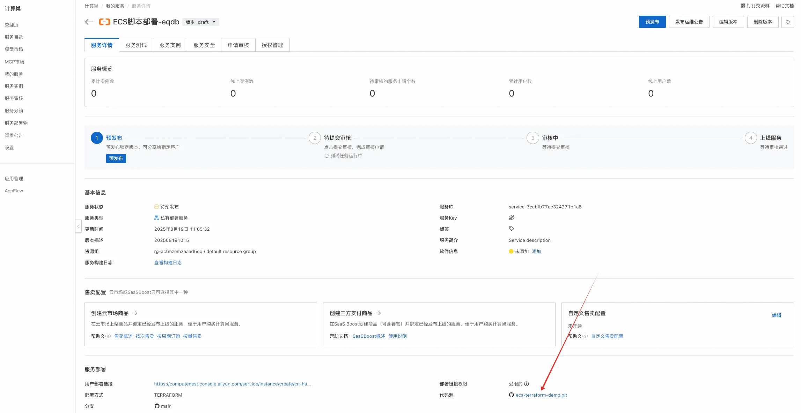
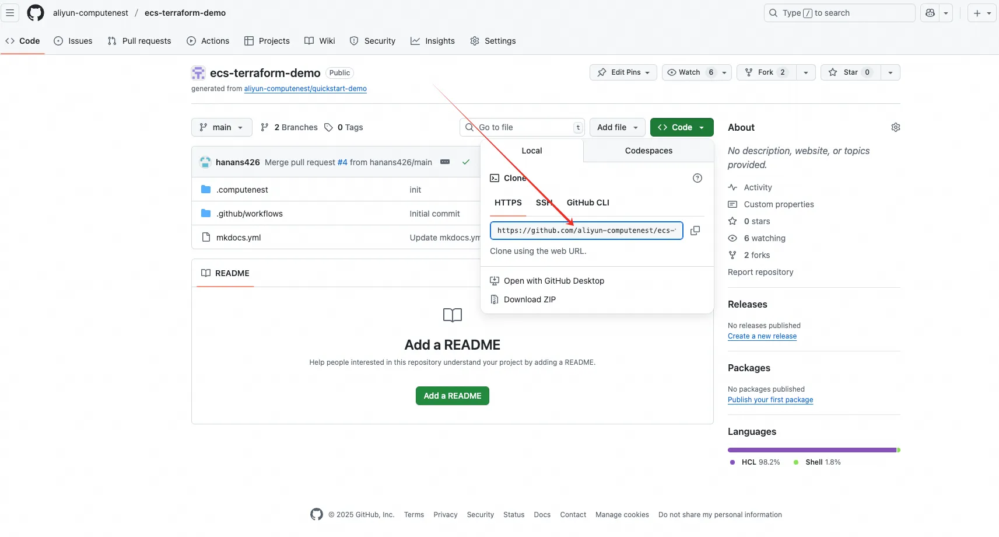
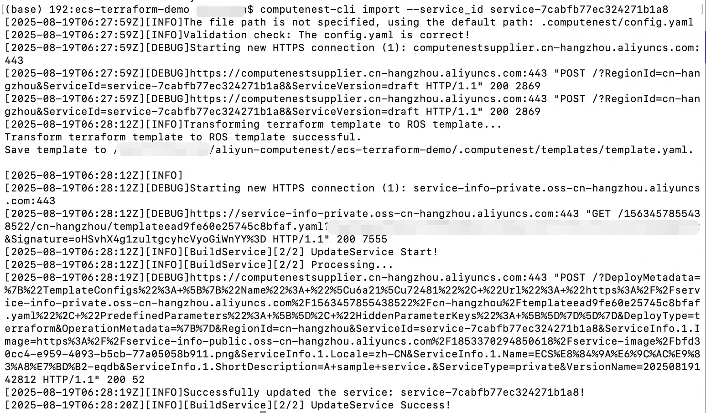

# 服务模板说明文档

## 说明

本项目以使用单机ECS部署Nginx为例，介绍通过Terraform部署方式快速构建计算巢服务的流程。
本示例对应的Git仓库地址：[ecs-terraform-demo](https://github.com/aliyun-computenest/ecs-terraform-demo)。

## 部署架构


## 使用说明
通过此精选模板，可以快速创建一个支持Terraform部署方式的服务。如果您想部署自己的软件，或者修改服务，有两种方式：
#### 方式一：直接通过计算巢控制台编辑服务
1. 到计算巢"我的服务"中，找到创建成功的服务，点击编辑版本
2. 可以在模板区域查看模板并修改（建议将Terraform模板复制到编辑器中后编辑完再复制回控制台）。
3. 除此之外还可以在控制台设置一些服务的功能，例如套餐功能、服务运维功能等。
4. 编辑完成后点击保存更新即可。
#### 方式二：仓库拉取到本地并采用计算巢命令行工具进行服务更新
1. 拉取仓库到本地：点击刚创建的服务查看详情，可以看到代码源和分支，直接点击代码源查看该仓库
   
   拉取仓库到本地
   
   以该仓库为例，拉取命令：
   `git clone https://github.com/aliyun-computenest/ecs-terraform-demo?file=ecs-terraform-demo.git`
2. 下载computenest-cli命令行工具，执行一下命令，确保当前的环境python>=3.7
   `pip install computenest-cli`
3. 修改仓库内容： 

   **目录说明**
   .computenest: 计算巢根目录
   - docs：相关文档说明
   - templates: 模板相关配置
     - infrastructure: 基础设施相关配置
       - main.tf: 资源定义，即需要的云资源
       - output.tf: 输出定义，即服务部署完成后的输出
       - variables.tf: 参数定义，即需要用户填写的部署参数
     - schema.yaml: ROS相关配置，计算巢使用的阿里云ROS托管的Terraform，定义此文件是为了更好的页面渲染效果
     - scripts：执行脚本（启动、初始化等）
       - startup.sh：启动脚本
   
   **详细说明**
   本仓库是使用单机ECS镜像部署Nginx的示例，您可根据自身项目架构及资源需求修改以下内容：
   - 修改目录 .computenest/templates/infrastructure下的Terraform模板，其中main.tf 中定义了ECS实例使用的镜像为"centos_7_9_x64_20G_alibase_20240403.vhd"，
     您可以按需调整为自己的镜像，也可在使用此占位符，待计算巢创建服务后，进行ECS镜像关联。若您的服务需要通过自定义镜像/云市场镜像部署，且支持多地域，推荐您可以使用ECS镜像关联功能，可将模板中的镜像替换为镜像部署物中已经分发的镜像。详情见[《镜像关联》](https://help.aliyun.com/zh/compute-nest/image-association?spm=5176.24779694.console-base_help.dexternal.17e64d22Y2GavD)。
   - 修改参数的页面渲染配置 .computenest/templates/ros_schema.yaml 的文件 ros_schema.yaml中分为三大部分：
     - Parameters： 与ROS类型模板参数（Parameters）语法相同, 其中参数的命名需要与variables.tf中参数命名保持一致，在渲染时则会按照Parameters中的配置进行展示
     - Metadata：与ROS类型模板参数（Metadata）语法相同，支持对Parameters中定义的参数进行分组，以及对自定义参数进行隐藏。
     - Outputs：与ROS类型模板输出（Outputs）语法相同，其中Outputs的value命名需要和output.tf中命令保持一致，需要最终在计算巢概览页中对用户展示的输出
   - 修改自定义部署脚本，您可根据需要修改 .computenest/templates/scripts/startup.sh 的脚本, 在ECS启动时，将会自动执行脚本内容。

5. 修改完Terraform模板后，通过命令行工具执行import命令更新服务。
   如何获取 AccessKey 对：https://help.aliyun.com/zh/id-verification/obtain-an-accesskey-pair。
    ```shell
    # 首先运行登录命令
    computenest-cli login --access_key_id=xxx --access_key_secret=xxxx
    # 执行更新命令
    computenest-cli import --service_id service-xxx
    ```
   上述命令中，替换access_key_id和access_key_secret为自己的AK、SK, 将service-xxx替换为自己的计算巢服务id,修改的执行如下所示：
   
   通过上述方式，可以实现服务的更新。

   

